# AI-Assisted Research Reference

Deep dive on leveraging AI for UX research acceleration while maintaining quality and validity.

---

## AI-Powered Analysis & Synthesis

**Purpose:** Accelerate qualitative data processing and pattern identification

**When to use:** Large volumes of interview data, customer feedback, support tickets

**Time savings:** Up to 80% reduction in analysis time

**Output:** Automated themes, sentiment analysis, insight summaries

### Key Capabilities

| Capability | Description | Accuracy |
|------------|-------------|----------|
| Transcription | Speaker-detected audio-to-text | 90%+ |
| Sentiment | Positive/neutral/negative classification | 85%+ |
| Theme clustering | Automatic pattern grouping | Human validation required |
| Summarization | Key points extraction | Human validation required |
| Cross-study search | Query across all research | Tool-dependent |

### AI Analysis Workflow

```mermaid
flowchart LR
    subgraph Input["Data Collection"]
        A[Interviews]
        B[Surveys]
        C[Support Tickets]
        D[Session Recordings]
    end

    subgraph AI["AI Processing"]
        E[Auto-Transcription]
        F[Sentiment Analysis]
        G[Theme Clustering]
        H[Pattern Detection]
    end

    subgraph Human["Human Validation"]
        I[Review AI Insights]
        J[Verify with Source]
        K[Refine Themes]
        L[Strategic Interpretation]
    end

    subgraph Output["Deliverables"]
        M[Validated Insights]
        N[Research Report]
        O[Recommendations]
    end

    Input --> AI
    AI --> Human
    Human --> Output
```



### Best Practices

**Do:**
- Always validate AI-generated insights with source data
- Use AI for speed, human judgment for interpretation
- Maintain traceability from insight to raw data
- Combine with manual analysis for complex research
- Document which insights came from AI vs. manual analysis

**Don't:**
- Accept AI themes without reviewing source quotes
- Use AI for sensitive or high-stakes research without validation
- Assume AI understands context or nuance
- Skip reading transcripts entirely

---

## AI Research Tools (2026)

### All-in-One Platforms

| Tool | Strengths | AI Features | Pricing |
|------|-----------|-------------|---------|
| **Dovetail** | AI-native insights hub | Magic clustering, sentiment, auto-tagging | Free tier, $15/user/mo Pro |
| **Looppanel** | High accuracy transcription | 90%+ accuracy, cited answers, auto-tags | $30/mo Solo, $395/mo Pro |
| **Grain** | Meeting documentation | Highlights, summaries, search | $19/mo |
| **Marvin** | Research repository | AI search, theme detection | Contact for pricing |
| **Notably** | Qualitative analysis | Auto-coding, synthesis | $25/mo |

### Specialized Tools

| Tool | Purpose | Best For |
|------|---------|----------|
| **Otter.ai** | Transcription | Meeting notes, interviews |
| **Rev** | Transcription | High accuracy needs |
| **MonkeyLearn** | Text analysis | Sentiment, classification |
| **ChatGPT/Claude** | Analysis assistance | Theme exploration, summaries |

### Selection Criteria

1. **Transcription accuracy** - Critical for interview research
2. **Citation/traceability** - Can you trace insights to source?
3. **Team collaboration** - Multi-researcher support
4. **Integration** - Works with existing tools
5. **Data privacy** - Where is data stored/processed?
6. **Export options** - Can you get data out?

---

## Synthetic Users & AI Participants

### Definition

A synthetic audience is an AI-generated consumer profile designed to represent how a real customer segment thinks, feels, and behaves. Built using data, fine-tuning, prompting, or LLMs, these personas act as digital stand-ins for real users.

### Appropriate Use Cases

| Use Case | Suitability | Notes |
|----------|-------------|-------|
| Early concept exploration | Good | Generate hypotheses to test |
| Low-risk consumer products | Moderate | Validate with real users |
| Identifying edge cases | Good | AI can explore extremes |
| Generating research questions | Good | Prepare for human research |
| Interview practice | Good | Train moderators |

### Inappropriate Use Cases

| Use Case | Risk | Why |
|----------|------|-----|
| High-stakes decisions | High | Cannot replace real user validation |
| Regulated industries | High | Compliance requires real user data |
| Emotional/sensitive topics | High | AI lacks genuine emotional response |
| Novel/innovative products | High | AI trained on past, not future |
| Accessibility research | High | Cannot simulate lived experience |

### Limitations & Cautions

1. **Median user bias** - Represents "average," misses real human variability
2. **Historical bias** - Training data reflects past, not emerging behaviors
3. **No genuine emotion** - Simulates but doesn't feel
4. **Confirmation bias risk** - Can reinforce existing assumptions
5. **Overconfidence trap** - Feels like research but isn't validated

### Industry Perspective (2026)

- 48% of researchers see synthetic users as impactful
- High skepticism about full replacement of human research
- Best used to make human research "faster, bolder, and more focused"
- Growing adoption for early ideation phases

### Tools

| Tool | Description | Notes |
|------|-------------|-------|
| **Synthetic Users** | Dedicated synthetic audience platform | Consumer research focus |
| **UserTesting AI** | AI personas within testing platform | Integrated with human panels |
| **Custom GPT Personas** | Build your own AI personas | Requires prompt engineering |

---

## Validation Framework

### When AI Insights Require Human Validation

| Signal | Action |
|--------|--------|
| Novel or surprising finding | Deep-dive into source quotes |
| Strategic importance | Manual analysis confirmation |
| Contradicts other data | Triangulate with additional sources |
| Single-source insight | Seek corroboration |
| Stakeholder-facing | Human review before presenting |

### Validation Checklist

- [ ] AI insight traces to specific source quote(s)
- [ ] Theme appears in multiple participant data
- [ ] Insight aligns with (or explains contradiction in) other data
- [ ] Human researcher agrees with interpretation
- [ ] Context not lost in AI summarization

---

## Prompt Engineering for Research Analysis

### Theme Extraction Prompt Template

```
I have transcripts from [N] user interviews about [TOPIC].

Please analyze and identify:
1. Key themes that appear across multiple interviews
2. For each theme, cite specific quotes from participants
3. Note any contradictions or tensions between participants
4. Identify potential outliers or unique perspectives

Format output as:
## Theme: [Name]
**Frequency:** [N participants]
**Key quotes:**
- P1: "..."
- P3: "..."
**Interpretation:** [Your analysis]
**Contradictions:** [If any]
```

### Sentiment Analysis Prompt Template

```
Analyze the following user feedback for sentiment.

For each piece of feedback:
1. Classify as Positive / Neutral / Negative
2. Identify the specific feature or aspect being discussed
3. Extract the underlying need or expectation
4. Note the intensity (strong/moderate/mild)

Format as a table with columns:
Feedback | Sentiment | Intensity | Topic | Underlying Need
```

### Synthesis Summary Prompt Template

```
Based on [N] research sessions about [TOPIC], create an executive summary.

Include:
1. Research objective and methodology (2 sentences)
2. Top 3 insights with supporting evidence
3. Key recommendations prioritized by impact
4. Limitations and caveats
5. Suggested next steps

Keep summary under 500 words.
Target audience: [stakeholder type]
```

---

## Privacy & Ethics in AI Research

### Data Handling

| Concern | Mitigation |
|---------|------------|
| PII in transcripts | Anonymize before AI processing |
| Data retention | Understand tool's data policies |
| Training data | Check if your data trains models |
| Cross-border transfer | Verify GDPR/privacy compliance |

### Transparency Requirements (2026+)

- Disclose AI use in research methodology sections
- Document which analyses used AI assistance
- Maintain audit trail from insight to source
- Be clear about AI limitations in findings

### Participant Consent

Modern consent forms should include:
- Recording consent (audio/video)
- Transcription consent (AI-powered)
- AI analysis disclosure
- Data retention period
- Right to withdrawal

---

## Integration Patterns

### AI-Human Hybrid Workflow

**Best Practice:** Use AI for breadth, humans for depth.

1. **AI First Pass**
   - Auto-transcribe all sessions
   - Generate initial theme candidates
   - Flag high-sentiment segments
   - Create summary drafts

2. **Human Review**
   - Validate themes against transcripts
   - Add context and nuance
   - Identify strategic implications
   - Make recommendations

3. **AI Refinement**
   - Update themes based on human input
   - Generate final reports
   - Create searchable repository entries

### Quality Metrics

Track AI analysis quality over time:

| Metric | Target | Measurement |
|--------|--------|-------------|
| Theme accuracy | >80% agreement with manual | Sample validation |
| Citation validity | 100% traceable | Spot checks |
| Sentiment accuracy | >85% agreement | Validation sample |
| Time savings | >50% reduction | Before/after comparison |
