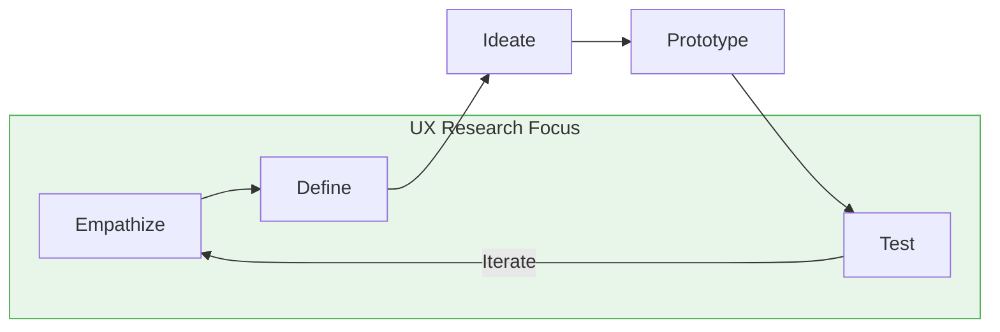
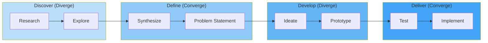
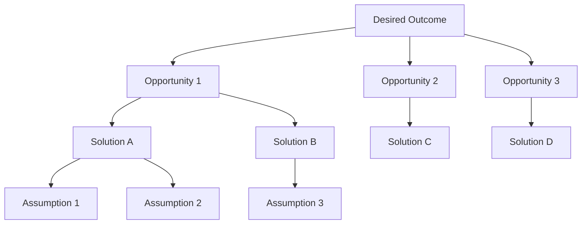
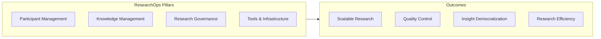

# UX Research Frameworks Reference

Key methodologies and frameworks that guide UX research practice.

---

## Jobs-to-be-Done (JTBD)

### Core Concept

People don't buy products; they hire them to get jobs done.

### Job Statement Format

```
When [situation], I want to [motivation], so I can [expected outcome].
```

### Examples

| Domain | Job Statement |
|--------|---------------|
| Commuting | "When commuting to work, I want to catch up on news, so I can feel informed and prepared for the day." |
| Cooking | "When preparing dinner quickly, I want simple recipes, so I can feed my family healthy food without stress." |
| Finance | "When unexpected expenses arise, I want quick access to funds, so I can handle emergencies without anxiety." |

### Job Map Stages

1. **Define the job** - Understand what needs to be accomplished
2. **Locate necessary inputs** - Gather required information/materials
3. **Prepare the components** - Set up for execution
4. **Confirm readiness** - Verify everything is in place
5. **Execute the job** - Perform the core activity
6. **Monitor results** - Track progress and outcomes
7. **Modify as needed** - Adjust based on feedback
8. **Conclude the job** - Complete and wrap up

### Interview Questions for JTBD

- "What were you trying to accomplish when you..."
- "What was the trigger that made you look for a solution?"
- "What alternatives did you consider?"
- "What would have to be true for you to switch to something else?"
- "What's the hardest part about [job]?"

### Outcome Statements

Format: **Direction + Metric + Context**

Examples:
- Minimize the time to find relevant information
- Increase the accuracy of search results
- Reduce the likelihood of missing important updates

---

## Design Thinking Discovery Phase

### The Five Stages



### Empathize Phase (Research-Heavy)

**Activities:**
- User interviews
- Observational research
- Empathy mapping
- Stakeholder interviews

**Outputs:**
- Interview notes and recordings
- Observation logs
- Empathy maps
- Stakeholder requirements

### Define Phase (Synthesis)

**Activities:**
- Affinity diagramming
- Problem framing
- Point-of-view statements
- "How might we" questions

**Point of View Statement Format:**
```
[User] needs [need] because [insight].
```

**How Might We Format:**
```
How might we [action] for [user] so that [outcome]?
```

### Test Phase (Evaluative)

**Activities:**
- Usability testing
- Concept testing
- Prototype validation
- A/B testing

**Outputs:**
- Usability findings
- Concept feedback
- Validation results
- Iteration recommendations

---

## Double Diamond Model

### Overview



### Research Activities by Diamond

| Diamond | Phase | Research Type | Methods |
|---------|-------|---------------|---------|
| 1 | Discover | Generative | Interviews, Ethnography, Diary Studies |
| 1 | Define | Synthesis | Affinity Mapping, Journey Maps, Personas |
| 2 | Develop | Evaluative | Concept Testing, Rapid Prototyping |
| 2 | Deliver | Validation | Usability Testing, A/B Testing |

### Key Principles

1. **Diverge before converging** - Explore broadly, then focus
2. **Problem space before solution space** - Understand before solving
3. **Iterate between diamonds** - Revisit as needed
4. **User-centered throughout** - Research informs every phase

---

## Continuous Discovery Framework

### Core Definition (Teresa Torres)

> "At minimum, weekly touchpoints with customers, by the team building the product, where they conduct small research activities, in pursuit of a desired outcome."

### The Opportunity Solution Tree



### Key Practices

1. **Weekly Customer Interviews**
   - Make talking to customers a keystone habit
   - 30-minute interviews, minimum 1 per week
   - Whole product trio participates

2. **Opportunity Solution Trees (OST)**
   - Living map connecting outcomes to opportunities to solutions
   - Updated continuously based on learnings
   - Visible to entire team

3. **Product Trio Collaboration**
   - PM, Designer, and Engineer working together on discovery
   - Shared understanding of customer problems
   - Collaborative decision-making

4. **Focus on Outcomes Over Outputs**
   - Desired outcome as the north star
   - Measure success by impact, not features shipped
   - OKR-aligned research

5. **Compare and Contrast Mindset**
   - Evaluate multiple options
   - Combat confirmation bias
   - Set-based design thinking

6. **Rapid Assumption Testing**
   - Identify riskiest assumptions
   - Design smallest tests
   - Learn before building

### Assumption Testing Types

| Test Type | Speed | Fidelity | Best For |
|-----------|-------|----------|----------|
| One-question survey | Hours | Low | Demand validation |
| Prototype test | Days | Medium | Usability |
| Data analysis | Hours | Variable | Behavior patterns |
| Fake door test | Days | Medium | Feature interest |
| Wizard of Oz | Weeks | High | Complex interactions |

---

## Lean UX Research

### Principles

1. **Minimum viable research** - Smallest study to answer the question
2. **Collaborative sensemaking** - Team synthesizes together
3. **Continuous discovery** - Always be learning
4. **Hypothesis-driven** - Test beliefs, not just explore

### Rapid Research Cycle

| Phase | Duration | Activities |
|-------|----------|------------|
| Hypothesis | 2 hours | Define what we believe and why |
| Design | 4 hours | Plan lightweight study |
| Conduct | 1-3 days | Execute research |
| Synthesize | 2 hours | Team analysis session |
| Decide | 1 hour | Make product decisions |

### Hypothesis Format

```
We believe [user type] has [problem]
Because we observed [evidence]
We will [action/solution]
And measure [success metric]
```

---

## Research Repository Pattern

### Purpose

Centralize and democratize research insights across organization.

### Structure

| Layer | Content | Audience |
|-------|---------|----------|
| **Observations** | Raw data points from research | Researchers |
| **Insights** | Synthesized learnings | Product teams |
| **Evidence** | Links to source data | Validation |
| **Tags** | Themes, products, user segments | Discovery |
| **Projects** | Grouped by research initiative | Organization |

### Tools

| Tool | Strengths | Best For |
|------|-----------|----------|
| Dovetail | AI-native, collaborative | Teams with budget |
| Notion | Flexible, affordable | Small teams |
| Airtable | Structured, relational | Data-heavy orgs |
| Condens | Research-focused | Dedicated research teams |
| Looppanel | AI analysis, citations | Interview-heavy research |

### 2026 AI-Powered Repository Features

- Conversational querying across all past research
- Automatic insight clustering and theme detection
- AI-generated research summaries
- Cross-study pattern identification
- Cited answers with traceability to source data

---

## Research Operations (ResearchOps)

### Definition

> "The people, mechanisms, and strategies that set user research in motion. It provides the roles, tools and processes needed to support researchers in delivering and scaling the impact of the craft across an organisation." - ResearchOps Community

### Core Pillars



### Core Functions

| Function | Activities |
|----------|------------|
| **Participant Recruitment** | Panel building, scheduling, incentives |
| **Tools & Infrastructure** | Selection, integration, maintenance |
| **Knowledge Management** | Repository, curation, search |
| **Governance & Quality** | Standards, ethics, compliance, training |
| **Enablement** | Self-service tools, templates, training |

### Scaling Considerations

| Team Size | ResearchOps Model |
|-----------|-------------------|
| 1-3 researchers | Researcher handles ops |
| 4-7 researchers | Part-time ResearchOps role |
| 8-15 researchers | Dedicated ResearchOps manager |
| 15+ researchers | ResearchOps team |

**Typical Ratio:** 1 ResearchOps manager : 7-15 researchers

**Industry Average:** 50 developers : 5 designers : 1 researcher

---

## Inclusive & Accessible Research

### Principle

Disabled participants can and should be part of every research phase - formative, prototype, and summative.

### Key Practices

1. **Build accessibility into personas** - Identify barriers early
2. **Multiple contact methods** - Email, phone, text
3. **Flexible scheduling** - Accommodate different needs
4. **Diverse research methods** - Verbal, written, visual options
5. **Adapted materials** - Large print, screen reader compatible
6. **Built-in breaks** - Flexibility during sessions
7. **Transparency** - Clear about how insights will be used

### Important Distinction

Research participants are not accessibility testers. They should provide feedback about usability, feasibility, and understandability - not test whether a system can be accessed.

### Recruitment Resources

| Resource | Description |
|----------|-------------|
| **Fable** | Dedicated panel of participants with disabilities |
| **Userlytics** | In-house panel with accessibility focus |
| **Disability advocacy orgs** | Community connections |

### Assistive Technologies to Consider

| Technology | Users |
|------------|-------|
| Screen readers (JAWS, NVDA, VoiceOver) | Blind/low vision |
| Voice recognition | Motor disabilities |
| Alternative input devices | Motor disabilities |
| Magnification tools | Low vision |
| Captions and visual alerts | Deaf/hard of hearing |

### Accessible Research Tools

- SurveyMonkey (WCAG compliant)
- Qualtrics (accessibility features)
- Zoom (captions, screen reader support)
- Microsoft Teams (accessibility features)
